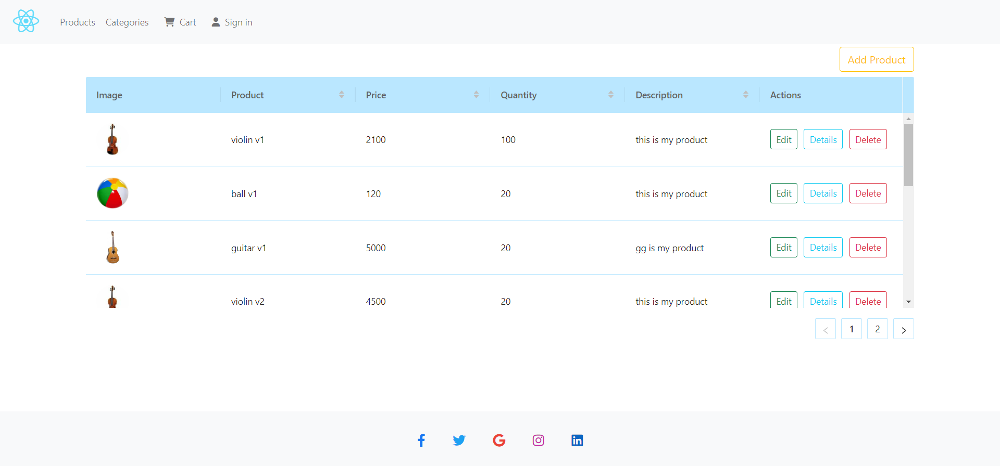
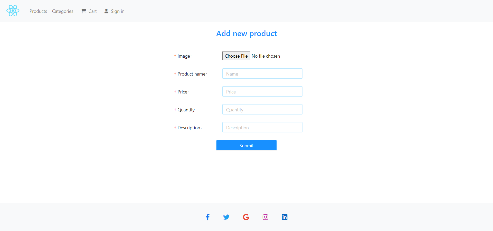
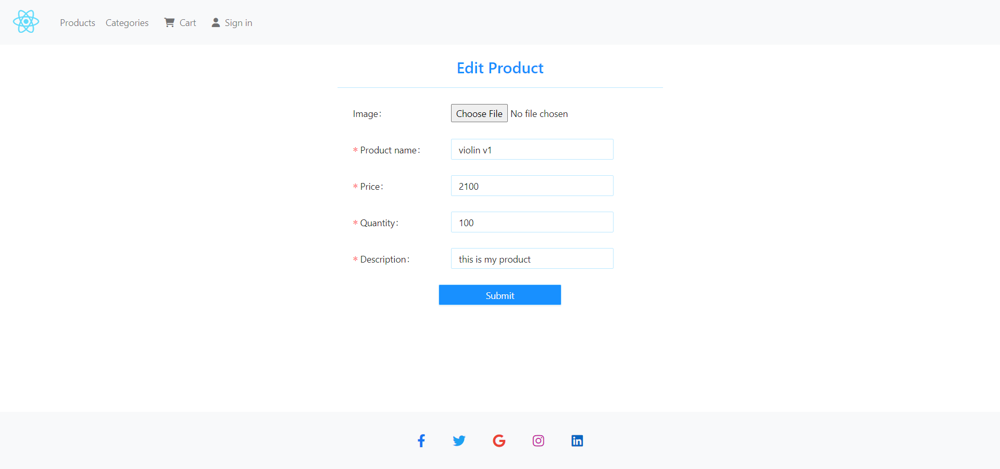
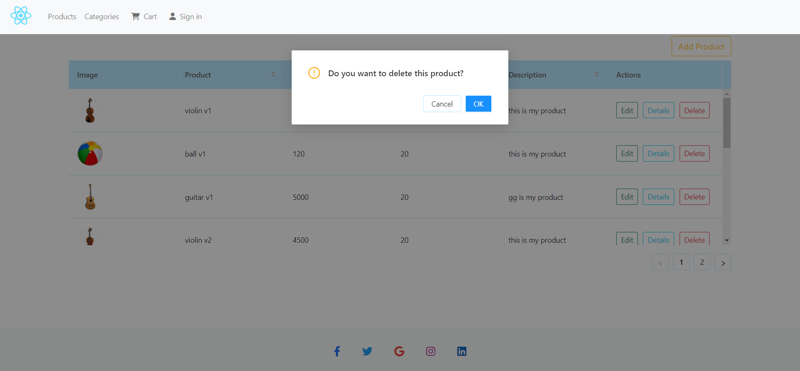
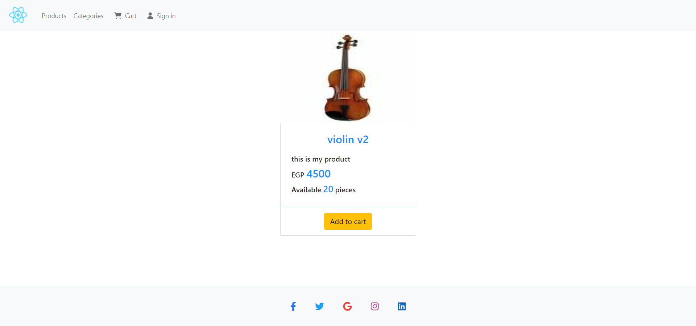
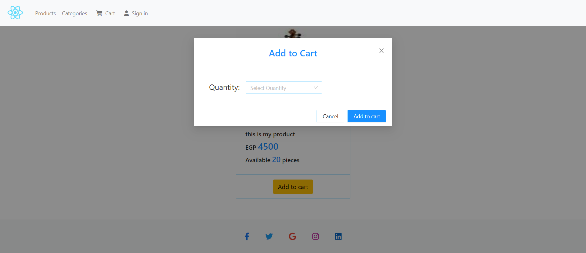
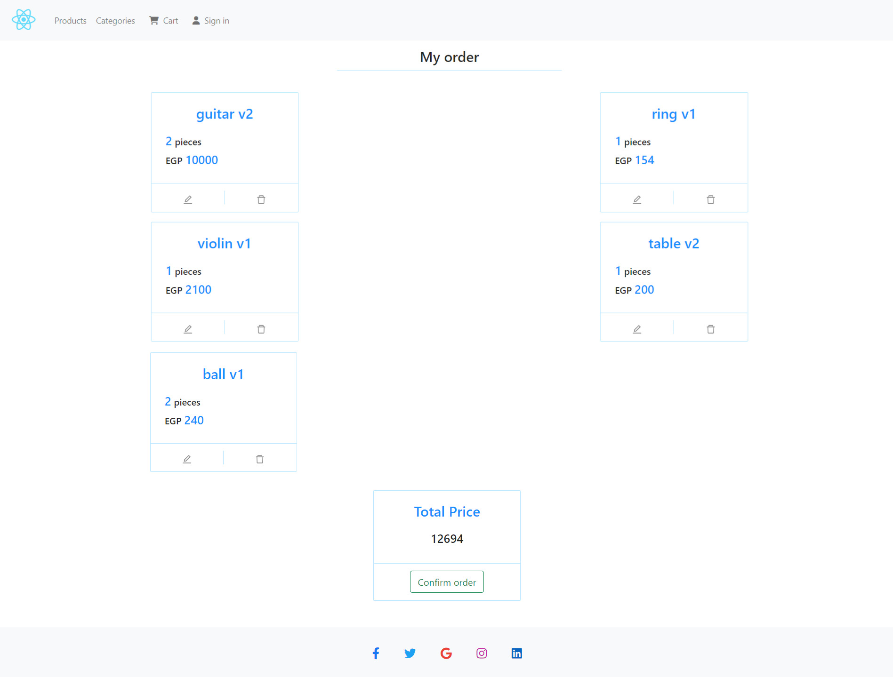

# products-categories_crud_React

This is the last Lab in React course in ITI. 

Features: 
- Products list, add a new product, delete a product, edit an existing product, and add any product to the cart.
- Categories list, add a new category, delete a category, and edit an existing one.
- Show products in the cart.

### Screenshot

### Built with

- HTML5
- CSS3
- Bootstrap
- React.js
- Ant Design
- Fake server
